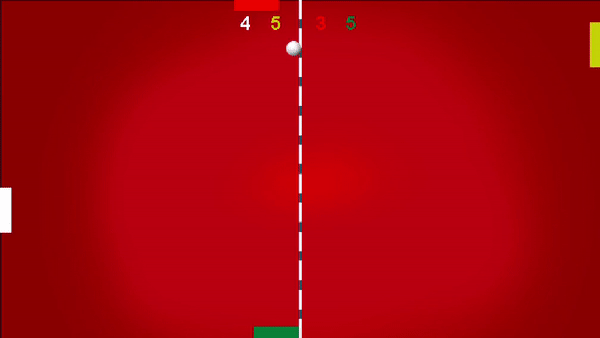

Ping4Pong                                                                   
----------                                                                              
                                           Project completed during June and July 2019.
                                     Uploaded on December 22, 2019, re-uploaded on July 10, 2020.

This game was built with the help of the book: [The Beginner's Guide to Android Game Development, by James S. Cho](https://www.amazon.com/Beginners-Guide-Android-Game-Development/dp/1908689269).
The book version of the game looks as follows: 

**Book Version:**

A simple home screen shows up once the application is opened, and by clicking anywhere on that screen, the game starts.
The game is a simple, old-fashioned 2d ping pong simulation, but the user controls both of the paddles, with the controls
being inverted. Namely, when controlling the paddle on the left to go upwards, the paddle on the right goes downwards at the same time.
There is also a simple point counter at the top of the screen. Overall, even though I have learnt a lot from the book, I found this particular game to be lacking depth. That is why I have decided to add my own features/create my own version of the game.

**My Version:**

**Menu:**

I have added a menu screen containing 4 options:

1. Start
- Once you press play, you are presented with three difficulty levels: Easy, Medium, and Hard. Even though the rules of the game are 
simple, the game itself is not easy to master, so I thought that adding several difficulty levels would be a useful additon to the game.

2. Help
- Pressing this option leads you to the screen that explains all of the game's rules and controls.

3. Exit
- Quits the game.

4. Settings
- Here, you can change some of the game's rules based on your own preferences. Also, you can modfy the visuals, as well as the audio options.

**Gameplay:**

So, as mentioned above, the initial version of the game featured only 2 paddles, one on the left side of the screen,  
and one on the right, both being controlled by the user. I decided to make the one on the left the user's paddle, and 
add three AI paddles, one on each side of the screen(top,right,bottom). In other words, the user competes against three 
computer - controlled paddles. All 4 players begin with 5 lives, and if a ball gets past you (you concede a goal), you lose a life. The last player standing wins.

__Power-Ups:__

Another feature that I implemented are the power-ups. The idea behind this is that it would make the game more unpredictable and fun at the same time. Basically, you would have more to focus on rather than simply worrying about deflecting the ball away from your "goal". Every five seconds, a randomly selected power-up would appear, and once the user collects it, they will temporarily activate that particular power-up. Also, note that a player can only have one power-up active at a time. I came up with five different kinds of power-ups, as follows:

1. Life : Gives you an extra life.
2. Grow : Increases the size of your paddle.
3. Shrink : Decreases the size of your paddle.
4. Freeze : Prevents you from moving your paddle.
5. Invincibility : Builds a brick wall behind your paddle.

Note: The game is played entirely using the keyboard.

**Controls:**

**Menu:**

up - navigate up

down - navigate down

enter - confirm

left - return

M - return to the home page

**Gameplay:**

up - move the paddle upwards

down - move the paddle downwards

R - restart the game

F - force a winner, in case you have been already eliminated

M - return to the Main Menu

-----------------------------
Petar Bulatovic

[Video Demo](https://youtu.be/VwLrV693hHU) 
Download link: [Link](https://mega.nz/file/vH5xkYyC#FNq3XpqVFwclK4lfoaAvTpsuJNCJ2Hc2RNGwh_UXDS0)

Note : Requires Java to run.
